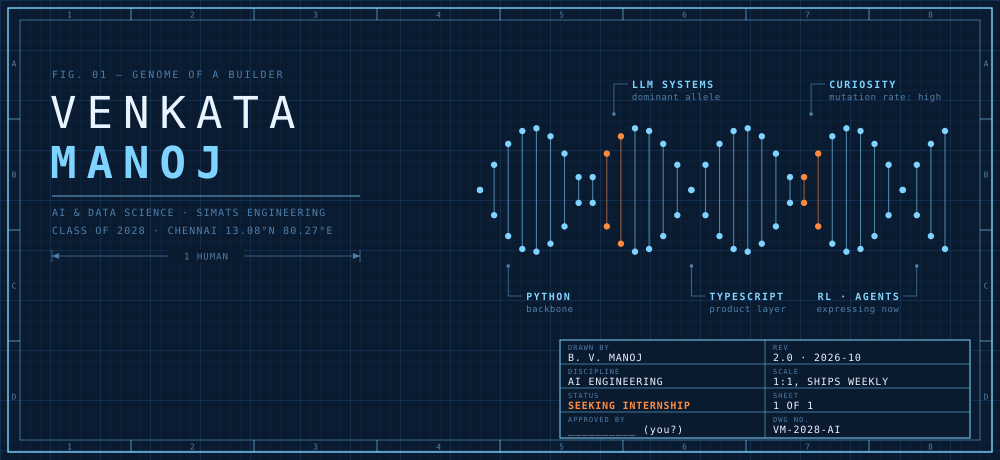
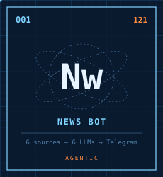
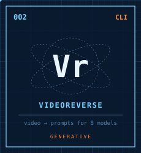
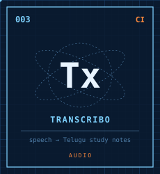
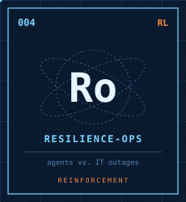
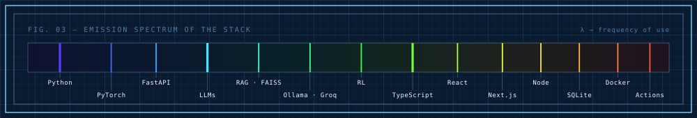
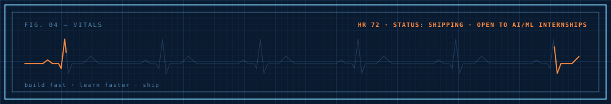

<code><a href="https://venkata-manoj.vercel.app/">PORTFOLIO ↗</a></code> · <code><a href="https://linkedin.com/in/venkata-manoj">LINKEDIN ↗</a></code> · <code><a href="https://x.com/Manoj13016367">X ↗</a></code> · <code><a href="https://venkata-manoj-sketch.vercel.app">SKETCHBOOK ↗</a></code> · <code><a href="https://vmb-iota.vercel.app">BOOK FOLIO ↗</a></code>

<table align="center"><tr>
<td></td>
<td></td>
<td></td>
<td></td>
</tr><tr align="center">
<td><a href="https://github.com/Venkata-Manoj/AI-News-Bot">source ↗</a></td>
<td><a href="https://github.com/Venkata-Manoj/videoreverse">source ↗</a></td>
<td><a href="https://github.com/Venkata-Manoj/transcribo">source ↗</a></td>
<td><a href="https://github.com/Venkata-Manoj/Resilience-Ops-Env">source ↗</a></td>
</tr></table>

#### `FIELD NOTES`

> **First law.** A pipeline at rest stays at rest. Mine fall back through six LLMs before they stop.
> **Second law.** Output = curiosity × deadlines. Hackathons supply the second term.
> **Third law.** Every feature I ship gets an equal and opposite test suite.

<code>APPENDIX A — other specimens (11)</code>

| Specimen | Observation |
|---|---|
| [Capstone-Forage](https://github.com/Venkata-Manoj/Capstone-Forage) | RAG report generator: FAISS + Ollama → DOCX/PDF |
| [WhatIF](https://github.com/Venkata-Manoj/WhatIF) · [live](https://what-if-henna.vercel.app) | AI review of UI components for bugs, a11y, perf |
| [Sign-Language-TTS](https://github.com/Venkata-Manoj/Sign-Language-TTS) | PyTorch LSTM sign recognition → speech |
| [Student-Performance-Predictor](https://github.com/Venkata-Manoj/Student-Performance-Predictor) · [live](https://student-performance-predictor-orpin.vercel.app) | XGBoost classifier + regressor |
| [IdeaForge_2k26](https://github.com/Venkata-Manoj/IdeaForge_2k26) · [live](https://ideaforge-2k26.vercel.app) | E-certificates for a real college event |
| [web-crawl](https://github.com/Venkata-Manoj/web-crawl) | BFS website cloner |
| [pathfinding-visualizer](https://github.com/Venkata-Manoj/pathfinding-visualizer) | Search algorithms, visualised |
| [Flip2Function](https://github.com/Venkata-Manoj/Flip2Function) · [live](https://v0-no-content-hazel-nu.vercel.app) | Phone orientation as the UI |
| [Habit-Zen-Web](https://github.com/Venkata-Manoj/Habit-Zen-Web) · [live](https://habit-zen-umber.vercel.app) | Habit heatmap + AI suggestions |
| [E-Voting-System](https://github.com/Venkata-Manoj/E-Voting-System) · [live](https://e-voting-system-eta.vercel.app) | SHA-256 hashed, tamper-evident voting |
| [Vibe-Learn](https://github.com/Venkata-Manoj/Vibe-Learn) · [live](https://vibe-learn-pi.vercel.app) | Prompt engineering, taught interactively |

DWG VM-2028-AI · drawn by hand, rendered in SVG · <a href="https://venkata-manoj.vercel.app/">portfolio</a> · <a href="https://linkedin.com/in/venkata-manoj">linkedin</a> · <a href="https://x.com/Manoj13016367">x</a>

